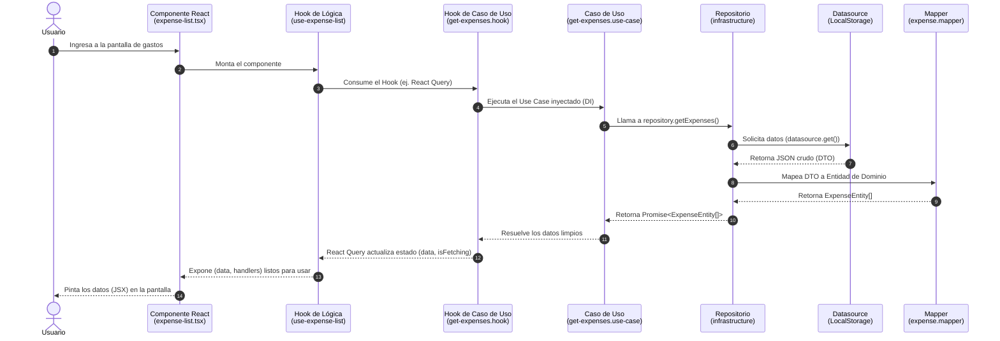

# Flujo de Trabajo (Workflow) en Clean Architecture

Este documento describe el flujo de vida completo de un requerimiento (ej. "Obtener todos los gastos"), partiendo desde la concepción en el núcleo de la aplicación (Dominio) hasta su consumo y renderizado en la interfaz gráfica (UI).

Tomaremos como referencia la estructura real de la característica **Expenses** (`src/features/expenses/`).

---

## 1. Capa de Dominio (El Contrato)

Todo comienza definiendo **qué** es lo que la aplicación hace, sin importar **cómo** lo hace.

- **Entidad**: Definimos el modelo de datos puro.
  _Archivo:_ `core/domain/entities/expense.entity.ts`
  Aquí se define la clase o interfaz `ExpenseEntity` con sus propiedades (monto, categoría, fecha, etc.).
- **Repositorio (Interfaz)**: Definimos el contrato para obtener los datos.
  _Archivo:_ `core/domain/repositories/expense.repository.ts`
  Creamos una interfaz (ej. `ExpenseRepository`) con un método como `getExpenses(): Promise<ExpenseEntity[]>`.

## 2. Capa de Infraestructura (La Implementación)

Aquí definimos el **cómo**. Conectamos la aplicación con el exterior (ej. LocalStorage, API).

- **Datasource y Repositorio Concreto**: Implementamos la interfaz del repositorio del dominio.
  _Archivos:_ `core/infrastructure/datasources/...` y `core/infrastructure/repositories/expense.repository.ts`
  La clase implementa `ExpenseRepository` y utiliza un Datasource (ej. `LocalStorageExpenseDatasource`) para ir a buscar los datos en crudo, y luego utiliza un **Mapper** (`expense.mapper.ts`) para convertir esos datos crudos (JSON/DTO) hacia instancias puras de `ExpenseEntity`.

## 3. Capa de Aplicación (El Caso de Uso)

Aquí orquestamos el flujo. El caso de uso es la acción específica que ejecuta el sistema.

- **Use Case**:
  _Archivo:_ `core/application/use-cases/expenses/get-expenses.use-case.ts`
  Se crea una clase `GetExpensesUseCase` que recibe por inyección en su constructor la interfaz `ExpenseRepository` (del dominio, nunca de infraestructura). Su único método público (ej. `execute()`) llama a `repository.getExpenses()` y retorna las entidades.

## 4. Inyección de Dependencias (DI)

Es el pegamento de la arquitectura. Junta la infraestructura con la aplicación para entregárselo a la UI.

- **Dependency Container**:
  _Archivo:_ `core/di/expense.dependency.ts`
  Aquí instanciamos las clases reales:
    1. Instanciamos el `ExpenseDatasource` (ej. para LocalStorage).
    2. Instanciamos el `ExpenseRepositoryImpl` inyectándole el datasource.
    3. Instanciamos `GetExpensesUseCase` inyectándole el repositorio.
    4. Exportamos el caso de uso instanciado para que la UI lo consuma.

## 5. Capa de Presentación: Hooks de Casos de Uso

La UI (React) no consume el caso de uso directamente en el componente para evitar acoplamiento y lógica compleja en la vista.

- **Hook de Use Case**:
  _Archivo:_ `presentation/hooks/use-cases/expenses/get-expenses.hook.ts`
  Importamos la instancia del caso de uso desde el archivo de DI.
  Creamos un Custom Hook (ej. `useGetExpenses`) donde ejecutamos el caso de uso. Frecuentemente, aquí se envuelve la llamada dentro de herramientas de estado asíncrono como **TanStack Query** (`useQuery`), manejando automáticamente estados de carga (`isFetching`), errores y caché.

## 6. Capa de Presentación: Hooks de Lógica (Opcional pero recomendado)

Si la vista requiere mucha manipulación de estado local, filtrados, o lógica adicional de UI.

- **Hook de Lógica**:
  _Archivo:_ `presentation/hooks/logic/expense/use-expense-list.hook.ts`
  Aquí podemos consumir `useGetExpenses()`, aplicar filtros de búsqueda, manejar paginación, o preparar los manejadores de eventos (handlers) que se pasarán a la vista. Este hook devuelve un objeto limpio con los datos y funciones listos para ser consumidos.

## 7. Capa de Presentación: Componentes (UI)

El eslabón final y el más "tonto" de la cadena.

- **Componente Visual**:
  _Archivo:_ `presentation/components/expense/expense-list.tsx`
  El componente de React importa y ejecuta el hook de lógica (`useExpenseList`) o directamente el hook del caso de uso.
  Simplemente se encarga de:
    1. Si `isFetching` es true, mostrar un `<Spinner />`.
    2. Si hay error, renderizar un `<ErrorMessage />`.
    3. Si hay datos (`ExpenseEntity[]`), iterar sobre ellos y pintar la interfaz devolviendo el JSX.

---

### Resumen Visual del Flujo

1. `domain/` **define las reglas**.
2. `infrastructure/` **cumple las reglas**.
3. `application/` **usa las reglas** para orquestar la acción.
4. `di/` **conecta infraestructura con aplicación**.
5. `presentation/hooks/` **adaptan** el caso de uso al ecosistema React (TanStack Query, estado).
6. `presentation/components/` **pintan** el resultado en la pantalla.

---

## Diagrama de Secuencia del Flujo de Ejecución

El siguiente diagrama muestra el viaje paso a paso, de principio a fin, durante el renderizado de la UI y la obtención de datos:

